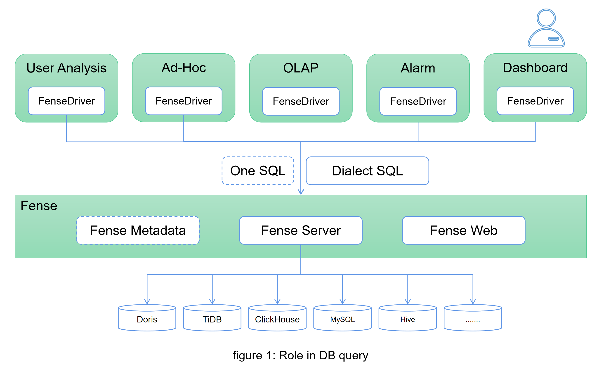

Fense DB Master (TM)
================

The Fense DB Master (TM) is a database proxy written in Java, which can connect DB of different engines at the same time.
Built on top of Apache Calcite Avatica (TM), it provides: 

* Authority Management
* Query Cache
* Audit Security
* Current Limiting & Fuse
* One SQL

Role in DB query
============

Getting Started
===============

Requirements
============

Java
------
- JDK 1.8+